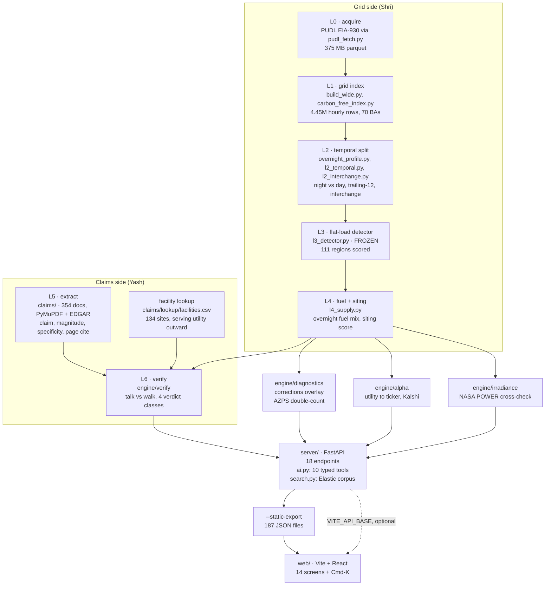

# Wattson

*It follows the power, not the press release.*

> **Wattson is a greenwashing investigation of datacenter operators. We settle every
> "100% renewable" claim against 4.45 million hours of federal meter data, and hand asset
> managers the named utility on the other side of the gap.**

**HackMIT 2026.** Team: Yash and Shri.
Live: https://shrishantrh.github.io/wattson/ · API: https://wattson-api-ivory-seastar-408.fly.dev/

Greenwashing analysis is mature for fast fashion, airlines and oil majors. It does not
exist for datacenters, the fastest-growing industrial electricity load in the United
States, because the claim is a sentence in a PDF and the evidence is nine years of hourly
data across seventy balancing authorities. **Wattson is the join.**

---

## Tracks

| Track | What we built for it |
|---|---|
| **Voloridge, "Signal in the Noise"** (primary) | The flat-load detector. 111 regions scored from demand data alone (L3), the siting score (L4), and the correction overlay. Built on PUDL EIA-930, Voloridge dataset #6, fetched with their own script. Reproducibility run on EC2. |
| **Arrowstreet, "Best Textual Analysis Hack"** | The claims layer. 354 documents ingested, claims extracted with page cites, scored for magnitude / specificity / hedging (L5), then verified against the grid each site draws from (L6). |
| **Elastic, "Find the Signal"** | `server/search.py`. 354 documents indexed (309 ESG, 45 10-K), exposed to the ask layer as `search_corpus`. Returns passage, ticker, page number and source URL. Live. |
| **OpenAI** | The ask layer, `server/ai.py`. Tool-calling loop over 10 typed tools, returns structured views. Live. |
| **Kalshi** | `engine/alpha/kalshi.py`. Contracts with strike, bid, ask and close on the Generating Alpha screen. |
| **xAI** | Grok narration on the irradiance screen. Live. |

Write-ups: `docs/voloridge/SUBMISSION.md`, `docs/arrowstreet/SUBMISSION.md`.

---

## Architecture



### Layers

| Layer | What it produces | Where |
|---|---|---|
| **L0** acquire | EIA-930 parquet from PUDL S3 | `scripts/vendor/pudl_fetch.py` |
| **L1** grid index | Hourly carbon-free share, 70 BAs, 4.45M rows | `scripts/build_wide.py`, `carbon_free_index.py` |
| **L2** temporal | Night vs day split, trailing-12, PJM interchange | `scripts/overnight_profile.py`, `l2_temporal.py`, `l2_interchange.py` |
| **L3** detector | 111 regions scored for flat 24/7 load, demand only. **Frozen, do not re-tune** | `scripts/l3_detector.py` |
| **L4** supply | Overnight fuel decomposition, siting score | `scripts/l4_supply.py` |
| **L5** extract | Claims with magnitude, specificity, hedging, page cite | `claims/`, `server/search.py` |
| **L6** verify | Talk vs walk, verdict per claim → `claims/companies.json` | `engine/verify` |
| **L7** interface | 14 screens, Cmd-K ask layer | `web/` |
| side | Corrections overlay, alpha chain, irradiance cross-check, alerts | `engine/diagnostics`, `engine/alpha`, `engine/irradiance`, `scripts/alerts.py` |

### How a verdict is made

1. A claim is pulled from a company PDF or filing, with its page number.
2. The facility lookup names the **serving utility** for each of that company's sites, then the balancing authority that utility sits in. Never inferred from the state.
3. L1 gives that BA's hourly carbon-free share; L2 splits it into overnight and daytime.
4. Walk = mean physical share across the mapped sites. Talk = magnitude × specificity × scope breadth.
5. The verdict is one of `true_on_paper`, `contradicted`, `unfalsifiable`, `cannot_verify`.

### Data flow at serve time

`server/` reads `claims/companies.json`, `dashboard/public/data/*` and the corrections overlay, and answers 18 endpoints. `--static-export` writes every endpoint response to `server/static_export/`, which `web/` bakes into `dist/api/`. The front end resolves data in order: `VITE_API_BASE` if set, then the baked export, then contract fixtures. **The demo runs entirely from the baked export: no server, no Python, no network.**

---

## What it does, in four moves

| Move | Screens | Question it answers |
|---|---|---|
| **Accuse** | Check, Companies | This company says it is clean. What actually powers its sites? |
| **Detect** | Found, Screener, Explore, Region, Alerts | Where is flat 24/7 load landing, and on whose grid? |
| **Advise** | Compare, Irradiance | Where should the next gigawatt go, and why does the hour decide it? |
| **Monetize** | Generating Alpha | Who is exposed to this? |

Plus **Method** and **Data**, so nothing above has to be taken on trust, and **⌘K**, which
answers free text against the real data and returns a table, not a paragraph.

---

## What the data says

**Clean power was added to the day, not the night.** Since 2019 the US added **64.7 GW** of
clean generation to the average daytime hour and **17.7 GW** to the average overnight hour,
3.7x more to the hours a datacenter does not use. The overnight *share* did not fall: it
held flat at **0.397** while demand grew underneath it.

> These are the **corrected** 2019 figures. The published national baseline includes AZPS's
> 3,373 MW overnight phantom, Palo Verde nuclear counted once under Arizona and once under
> SRP, which our own corrections file proves. Published 2019 overnight clean reads 159.0 GW;
> corrected it is 155.7 GW. Quote the corrected number and say that you corrected it.

**In PJM, overnight got dirtier.** Overnight generation grew 8.7 GW from 2019 to 2025. By
fuel: gas +10.7, coal -2.5, nuclear -0.9, wind +1.1, hydro -0.2, solar 0.0. Overnight net
exports fell from 3.8 GW to 2.5 GW, so the new generation serves PJM's own load, not its
neighbors. Consistent with datacenter load being served by gas; part of the gas rise is
coal-to-gas switching.

| | 2019 | 2025 |
|---|---|---|
| PJM overnight clean generation, avg MW | 35,700 | 35,619 |
| PJM overnight total generation, avg MW | 82,539 | 91,240 |
| PJM overnight carbon-free share | 0.433 | 0.390 |
| PJM overnight net export, avg MW | 3,814 | 2,489 |
| Dominion (N. Virginia) zone overnight demand, avg MW | 10,060 | 14,033 |

**El Paso Electric is the thesis in one grid:** 34.1% carbon-free at midday, **0.1% at
night**, one megawatt of clean generation out of 655. OpenAI's Santa Teresa campus sits
there.

Overnight is 00:00-05:59 local; daytime 10:00-15:59. Baseline 2019. Snapshot ends 2026-09-05.

---

## Coverage, as of the final build

| | |
|---|---|
| Hourly rows | 4.45M, EIA-930 via PUDL, 2018-07 to 2026-09-05 |
| Balancing authorities | 70 |
| Regions scored by the detector | 111 |
| Operators held | **52** |
| Sites located | **134**, each with a source URL and a confidence grade (42 high, 61 medium, 11 low) |
| Operators with their own filings read | 4 |
| Sites behind the meter | 11, invisible to a demand-only detector by construction. We state this rather than wait to be caught by it |
| Documents indexed | 354 (309 ESG, 45 10-K), searchable with page cites |

---

## Who built what

| | |
|---|---|
| **Shri** | The grid engine and the interface. L0-L4 pipeline (`scripts/`), carbon-free index, flat-load detector, siting score, fuel decomposition, export and alerts, and the front end shell. |
| **Yash** | The investigation layer. Claims pipeline (`claims/`), document ingestion and extraction, the company verdict schema, the facility-to-utility lookup, the API, the ask layer, and the Voloridge reproducibility run on EC2. |
| **Both** | The JSON schema for a company card was agreed before either side built against it, which is what let the two halves develop in parallel and still join. The honesty rules were argued out jointly: most of them exist because one of us tried to make a claim the other could not verify. |

---

## Repo map

| Path | What is in it |
|---|---|
| `scripts/` | L0-L4 data pipeline. **Frozen.** `l3_detector.py` is the detector; do not re-tune. |
| `engine/` | Verification, corrections, alpha, irradiance, diagnostics. `engine/verify` builds `claims/companies.json`. |
| `claims/` | The investigation. `lookup/facilities.csv` is the 134-site mapping, the row that flips verdicts. `companies.json` is the deliverable. |
| `server/` | FastAPI. `ai.py` is the ask layer, ten typed tools. `--static-export` bakes every endpoint to JSON so the demo needs no server. |
| `web/` | Vite + React front end. Builds `dist/` with the static export baked in. |
| `dashboard/` | The original dashboard. **Frozen fallback.** Do not edit. |
| `docs/` | Everything below. |

---

## The documents, and which to read first

| File | Use it for |
|---|---|
| **`docs/DEMO_VIDEO.md`** | **The 2:30 video script.** Exact words, screen direction, and a table of every figure with its source. Start here. |
| **`docs/judges_qa_redteam.md`** | 72 questions from six hostile experts (26 fatal, 35 serious), each answered from the data with an explicit concession. Read before judging. |
| `docs/DEVPOST.md` | All eight Devpost answers, ready to paste. |
| `docs/TABS.md` | Every screen, every control, what to say about it, and the trap a judge reaches for. |
| `docs/spec.md` | The full method. The Amendments block at the top overrides the body. |
| `docs/DEMO_RUNBOOK.md` | Running the live demo, and what to do when something breaks. |
| `docs/voloridge/SUBMISSION.md` · `docs/arrowstreet/SUBMISSION.md` | The two track write-ups. |
| `docs/DEPLOY.md` · `docs/DEPLOY_API.md` | Deploying the site and the API. |
| `docs/GLOSSARY.md` | Balancing authority, zone, carbon-free share, talk vs walk. |

---

## Language rules

Enforced in the code and in the copy.

| Rule | Instead |
|---|---|
| Never "caused by" | "consistent with", the detector flags flat load: datacenters, crypto, oilfield electrification |
| Never "they lied" | "true on paper, X physically", annual matched claims are valid under the GHG Protocol market-based method |
| Never a share alone | Give the absolute MW beside it |
| Never a zone's generation | Zones report demand only and inherit the parent BA's generation. PJM's +10.74 GW of gas is not Dominion's |
| Never a null as zero | Render an absent value as a phrase |

Scope: generation within a footprint, not consumption. Interchange is not allocated. Average grid mix, not marginal emissions.

---

## Running it

Python venv is `~/hackmit-venv`. `data/` is gitignored; re-fetch on a new machine (~375 MB).

```bash
source ~/hackmit-venv/bin/activate
python3 scripts/vendor/pudl_fetch.py --output-dir data/pudl \
  --table core_eia930__hourly_net_generation_by_energy_source \
  --table core_eia930__hourly_interchange \
  --table out_eia930__hourly_operations \
  --table out_eia930__hourly_subregion_demand \
  --table core_eia__codes_balancing_authorities \
  --table core_eia__codes_balancing_authority_subregions
python3 scripts/build_wide.py && python3 scripts/carbon_free_index.py
python3 scripts/overnight_profile.py && python3 scripts/l2_temporal.py && python3 scripts/l2_interchange.py
python3 scripts/l3_detector.py && python3 scripts/l4_supply.py
python3 scripts/export_json.py && python3 scripts/alerts.py
python3 -m engine.verify && python3 -m server --static-export
cd web && npm ci && npm run build
```

The built `web/dist/` is the demo. It needs no server, no Python and no network: every
endpoint is baked in as JSON. Keep a built `dist/` on two laptops before judging.

To run with the ask layer locally:

```bash
set -a && . ~/.wattson.env && set +a
python3 -m uvicorn server.app:app --port 8010
cd web && VITE_API_BASE=http://localhost:8010 npm run build
```
