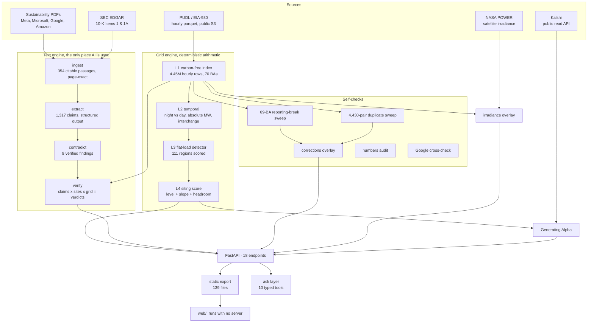

# Wattson, what it is, how it works, and what it found

*It follows the power, not the press release.*

---

## 0. How to say what this is

Three registers. Same claim, different lengths. The phrase **"greenwashing investigation
of datacenter operators"** appears in all three on purpose, it is the fastest way to make
a stranger understand the project, because everyone already knows what a greenwashing
investigation is for consumer brands and nobody has seen one pointed at this industry.

### One line

> **Wattson is a greenwashing investigation of datacenter operators, we settle every
> "100% renewable" claim against 4.45 million hours of federal meter data, and hand asset
> managers the named utility on the other side of the gap.**

Alternates, same content, pick by audience:

- *Industry:* Wattson is a greenwashing investigation of datacenter operators: the claim
  is a sentence in a PDF, the truth is nine years of hourly federal generation data, and
  we are the first people to join them.
- *Investor:* A greenwashing investigation of datacenter operators that ends in a ticker , 
  we rank 111 US grid regions by where flat 24/7 AI load is landing, and name the utility
  that has to burn something to serve it.
- *Blunt:* Everyone building AI datacenters says they run clean. We checked the meter.

### Fifteen seconds

> Every AI datacenter operator says it runs clean. Nobody had checked, because the claim
> is a sentence in a sustainability PDF and the evidence is 4.45 million hours of federal
> grid data across all 70 US balancing authorities. **Wattson is that join**, a
> greenwashing investigation of datacenter operators.
>
> And because every verdict resolves to a *named utility in a named region*, it is not
> just an exposé. **An asset manager can trade it.** We rank 111 regions by where flat
> 24/7 load is landing and who has to burn gas to serve it, which is a demand signal on
> regulated utilities before it shows up in a rate case.

### Thirty seconds

> Greenwashing analysis is a mature field, for fast fashion, airlines, oil majors. It
> does not exist for datacenters, which are now the fastest-growing industrial
> electricity load in the United States. Not because nobody cared, but because the claim
> and the evidence live in different formats.
>
> **Wattson is a greenwashing investigation of datacenter operators.** We take a company's
> published claim with a page cite, resolve which grid each of its datacenters physically
> draws from, and put its own words next to what the meter recorded.
>
> The finding is in the hours. **Since 2019 the US added 64.7 GW of clean power to the
> average daytime hour and 17.7 GW to the average overnight hour, 3.7x more to the hours
> a datacenter does not care about**, on a 2019 baseline corrected for a double-count we
> found in our own data. Solar cleaned up the middle of the day and did
> nothing for the middle of the night, and a datacenter draws the same power at 3am in January as at
> noon in June. In PJM, the grid serving the largest datacenter cluster on earth,
> **overnight clean generation has not increased since 2019.** Every added gigawatt of
> overnight generation was fossil. At annual resolution this finding does not exist.
>
> We never say a company lied, annual matched claims are genuinely true under the GHG
> Protocol. The verdict is *"true on paper, X physically."* **Two of a company's own
> published numbers side by side are not arguable.**
>
> For an asset manager that gap is an input: 111 regions ranked by where flat load is
> arriving, each mapped to the serving utility and its ticker, plus the physical
> constraint, clean headroom at 3am, that decides whether the next gigawatt gets served
> cleanly or with gas.

### The asset-manager use case, stated plainly

The investigation produces three things a fund can actually use:

| Output | What it is | Why it is tradeable |
|---|---|---|
| **Regional flat-load ranking** | 111 regions scored on the demand signature of 24/7 load, from hourly meter data | Load growth hits a regulated utility's rate base before it hits its filings |
| **Serving utility + ticker** | Each flagged region resolved to the utility that must serve it | Turns a grid observation into a named security |
| **Overnight clean headroom** | Clean MW available at 3am relative to overnight demand | Decides whether new load is served by existing clean capacity or new gas, a capex question |

We stop at the input. We publish no backtest, no price target and no position. See §12.

---

## 1. What this is

> **Wattson is a greenwashing investigation of datacenter operators, settled against
> 4.45 million hours of federal meter data.**

Every AI datacenter operator says it runs clean. Nobody checked against the meter, because
the claim is a sentence in a PDF and the answer is 4.45 million hourly rows across all 70
US balancing authorities. **We joined them.**

The signal was in the data the whole time, in the hours nobody looked at. **At annual
resolution this finding does not exist**, it only appears once you separate the hours.

### Why nobody had done it

Greenwashing analysis is a mature field, for consumer brands. Fast fashion, airlines,
oil majors, packaged goods: all have watchdogs, ratings, journalists, and standardized
frameworks pulling their claims apart. **Datacenters have none of that**, and they are now
the fastest-growing industrial electricity load in the United States.

The reason is not that nobody cared. It is that the claim and the evidence live in
different formats. A company says *"100% renewable"* in a PDF. The truth lives in nine
years of hourly federal generation data across seventy balancing authorities, which nobody
was joining to the PDF. So the claim went unchecked, not because it was hard to doubt,
but because it was hard to *check*.

**Wattson is the join.** We take the claim, resolve which grid each datacenter physically
draws from, and put the company's own words next to what the meter recorded.

### What it does

| Question | Screen | What it returns |
|---|---|---|
| *"This company says it's clean. What actually powers its sites?"* | **Check** | The claim verbatim with a page cite, the grid share its mapped sites ran on, a verdict, and the contradiction if there is one |
| *"Where should this load go?"* | **Compare** | 300 MW across three metros, ranked, with what fuel filled the last growth in each |
| *"Where is this load landing, and on whose grid?"* | **What we found** | 111 regions scored on flat-load signature, with the serving utility and its ticker |
| *"Who is exposed to this?"* | **Generating Alpha** | The chain from a metered measurement to an instrument, and where it stops |

### The finding that makes the audit bite

Once you have hourly data rather than annual totals, one fact does most of the work:

**Solar cleaned up the middle of the day. It did nothing for the middle of the night.**

That matters here and almost nowhere else, because **a datacenter draws the same power at
3am in January as at noon in June.** Roughly half of AI's electricity lands in the hours
that never improved. An annual "100% renewable" claim can be entirely true on paper and
still describe a facility that ran on gas every night for seven years.

In PJM, the grid serving the largest datacenter cluster on earth, **overnight clean
generation has not increased since 2019. Every added gigawatt of overnight generation was
fossil.**

### What we do not say

**We never say a company lied.** Annual matched claims are **true** under the GHG Protocol
market-based method, that is a legitimate accounting standard, not a loophole someone
invented. The verdict is *"true on paper, X physically."* We are not measuring honesty. We
are measuring the gap between a contract and a meter, and reporting that the gap exists
and how big it is.

That distinction is the whole reason the analysis holds up. A greenwashing accusation is
arguable. **Two of a company's own published numbers, side by side, are not.**

## 2. What we actually measure, precisely

| | |
|---|---|
| **Source** | EIA-930, the US Energy Information Administration's hourly grid dataset, via PUDL |
| **Scale** | 4.45 million hourly rows · 70 balancing authorities · July 2018 – September 2026 |
| **Carbon-free** | nuclear + hydro + wind + solar + geothermal |
| **Fossil** | gas + coal + oil |
| **Excluded** | storage on both sides. Other/unknown sits in the denominator but is never counted clean |
| **Overnight** | 00:00–05:59 local |
| **Daytime** | 10:00–15:59 local |
| **Baseline** | 2019 |
| **Snapshot ends** | 2026-09-05 |

**The unit is a balancing authority (BA)**, the entity that keeps supply equal to demand
on a chunk of grid. This matters more than it sounds: **BAs are organizational, not
geographic.** Small utility-run BAs nest inside large ones. Inferring a datacenter's grid
from its state is how you get the wrong answer.

**A "zone" is a slice inside a BA.** Zones report *demand only* and inherit their parent
BA's generation figures. `PJM/DOM`'s fuel numbers are PJM's, identical across every PJM
zone. This is the single easiest mistake to make with our data and we made it ourselves.

---

## 3. Architecture



**The crucial split:** the left half is deterministic arithmetic over federal metered
data. The right half is the only place a language model touches anything. **The AI reads
the text; the physics comes from the meter.** That division is why the verdicts survive
scrutiny.

---

## 4. The detector, how we find datacenters without a list of datacenters

**There is no company list anywhere in it.** It sees demand shape and nothing else.

```
score = z(overnight_excess) + z(neighbor_divergence) + 0.5 · z(load_factor_delta)
```

robust z (median / MAD), not mean / sd, so one outlier region cannot dominate.

| Term | Meaning | Why it signals flat load |
|---|---|---|
| **overnight_excess** | overnight demand growth % − average demand growth % | A datacenter grows the night as fast as the day. Residential and EV load is peakier. |
| **neighbor_divergence** | growth − median growth of adjacent zones in the same interconnection | Separates a local arrival from a regional trend |
| **load_factor_delta** | change in mean/peak demand | Flat load raises the load factor. Diluted at zone resolution, so weighted 0.5 |

Regions under 500 MW average demand are excluded. Peak is the **99.5th percentile hour**,
not the max, because PJM/DOM has one corrupt hour in 2019 reading over a billion MWh.

### Validation, pre-registered

Four regions were named **before the ranking was computed**:

| Named in advance | Result |
|---|---|
| PJM/DOM, Dominion, Northern Virginia | **6th of 111** |
| SWPP/OPPD, Omaha | **7th** |
| PJM/AEP, central Ohio | **19th** |
| ERCO/NCEN, Dallas | **91st, missed** |

**Why Dallas was missed, reported rather than fixed:** neighbor divergence compares a
zone against its neighbors, and *every* ERCOT zone is booming, so a booming Dallas looks
unremarkable relative to them. That is a property of the method. Weights were frozen
before results were seen and nothing was retuned.

**What it cannot do:** it finds flat 24/7 load in general. It cannot distinguish a
datacenter from a crypto mine or oilfield electrification. That is why ERCOT Far West
ranks 2nd, and it turns out to be the point, see §8.

---

## 5. The siting score, the actionable output

For a question like *"where do I put 300 MW of flat load?"*, three components:

| Component | What it asks |
|---|---|
| **Level** | overnight carbon-free share today (2025) |
| **Direction** | the 2019→2025 slope of that share |
| **Headroom** | overnight clean MW ÷ overnight demand |

One sentence: **"how clean the overnight grid is today, whether it's getting cleaner, and
how much clean headroom is left relative to demand."** Weights frozen before results.

300 MW across Phoenix / Northern Virginia / Omaha returns:

```
#1  Omaha         0.737   52% clean at night, improving
#2  Phoenix       0.449   corrected, see §7
#3  N. Virginia   0.436   39%, getting worse
```

**Phoenix ranks above Northern Virginia despite being dirtier today**, because it is
improving while Dominion is going backwards. For a fifteen-year siting decision that is
the trade.

---

## 6. The text layer, where AI is used, and where it deliberately is not

AI does exactly two jobs: **extracting atomic claims** and **retrieving contradictions**.
It is kept out of the facility lookup entirely, because it produces confidently wrong
balancing-authority mappings.

| Stage | What it does | Scale |
|---|---|---|
| **ingest** | 4 sustainability PDFs + 4 SEC 10-Ks → citable passages, page preserved | **354 passages** |
| **extract** | one structured-output call per chunk, 8 hand-written falsifiability anchors | **1,317 claims, 841 quantified** |
| **contradict** | deterministic pattern matching, every hit human-verified | **9 findings, 0 unverified** |
| **verify** | claims × mapped sites × grid share → verdict | **52 operators, 134 sites, 4 with documents read** |
| **retrieval** | Elasticsearch over all 354, cross-company and cross-document | live |

### Verdicts

`true_on_paper` · `contradicted` · `unfalsifiable` · `cannot_verify`

**We never say a company lied.** Annual matched claims are **true** under the GHG
Protocol market-based method. The verdict is *"true on paper, X physically"*, labelled
grid-only and explicitly excluding PPAs and RECs. `cannot_verify` carries an enumerated
reason, `no_falsifiable_content`, `no_site_mapping`, `ba_out_of_coverage`,
`year_out_of_range`, and its count renders on screen.

### The facility lookup, the trap that flips verdicts

Built by hand, from the serving utility outward, **never from the state**. **134 sites
across 52 operators**, every row with a source URL and a confidence grade, 42 high, 61
medium, 11 low. Confidence grades the *site → balancing authority* mapping, not the press
release: "company announced it, utility inferred from a city that straddles two BAs" is
`low`, and it ships as `low` rather than being dropped or dressed up.

`lat`/`lon` are deliberately blank on the expanded rows. Most public sources give a city,
not an address, and a city-centre pin rendered as a facility pin is exactly the kind of
small lie this project cannot afford.

**Eleven of these sites are behind the meter**, served by generation that never touches
the grid, so EIA-930 cannot see their load at all, and for two of them the operator's own
fact sheet says so in writing. This is a structural blind spot in a demand-only detector
and we state it on screen rather than waiting to be caught by it.

| Site | Naive guess | Actual | Effect |
|---|---|---|---|
| Meta, Prineville OR | BPAT (0.913) | **PACW** (0.75) | looks cleaner than it is |
| Microsoft, Quincy WA | BPAT | **GCPD** (1.00 hydro) | looks dirtier than it is |
| IREN, Childress TX | SWPP (Panhandle *is* SPP) | **ERCO**, 345 kV interconnect | wrong grid entirely |
| TeraWulf, Abernathy TX | ERCO (it's Texas) | **SWPP**, Xcel territory | wrong grid entirely |

**Childress and Abernathy are 120 miles apart and either rule of thumb gets one wrong.**
Only the serving utility settles it.

Three tickers in the research were stale and were corrected against filings: Bitfarms
`BITF` → **`KEEL`** (April 2026), Greenidge `GREE` → **`VIP`** (July 2026), and Stronghold
`SDIG` is delisted. TXNM was checked and is live and correct, which closes a known open
issue. One row was wrong in substance, not just in ticker: CoreWeave does **not** own the
Denton campus, the Core Scientific acquisition was voted down on 30 October 2025, so it
is recorded as a tenant at Core Scientific's site.

---

## 7. What we got wrong, and found ourselves

This is the section we would most want another team to read.

### AZPS, our own published number was wrong in *direction*

We published that Phoenix's overnight clean share **fell** from 0.620 to 0.104. It
actually **rose from 0.017**.

Through 2019, Arizona Public Service and Salt River Project **each reported the same
~3,900 MW of nuclear**, correlation 0.9948 over 7,976 hours, identical within 5 MW in
98.8% of them, and their combined output was **~1.8× Palo Verde's nameplate**. The series
ends in a step on a single date, 2019-12-04, not a decline.

Then we asked whether it was unique. **Every unordered pair of BAs, every fuel, every
hour both report, in 90-day sliding windows: 4,430 pairs, 580,410 window comparisons.**
One material duplicate. It is this one.

**The correction ships as an overlay**, not a rewrite, the API returns published *and*
corrected side by side with the evidence, because showing our own correction in place is
a better demo than a silently right number.

### Eight guards, and what each was blind to

Not one of the eight most serious failures was caught by a test.

1. A page-fidelity audit verified 309 citations with zero mismatches, and **could not see
   that the words within each page were scrambled**, because it compared each chunk to the
   same extraction that produced it. *A self-consistent check cannot detect a bias in the
   instrument it checks with.*
2. A verbatim guard proves a quote matches its chunk. It **cannot prove the chunk matches
   the document.**
3. An acceptance test named four pages; a rewrite passed all four and **silently broke a
   fifth**, the page four of nine findings cite.
4. The 10-K section slicer passed every synthetic test while **three of four real filings
   sliced wrong** (759 words instead of 11,754; a 52,000-word run-on; a 367-word truncation).
5. The alert ranking scored missing values as 1.0, so structural alerts swept the top
   eight and **the "prioritized" screen became the detector ranking relabelled.**
6. The first duplicate sweep **missed the pair it was built to find**, the duplication
   *ended*, and a whole-period test cannot see a duplication that stops.
7. A derived field **overwrote its own source**, destroying the record of what the model
   originally returned.
8. `(talk_score ?? 0)` drew Amazon's null score as a **0% bar**, asserting "Amazon talks
   at zero" from entirely correct JSON.

**The through-line:** every one produces a *plausible result* rather than a crash. The
question that catches them is never *"did the tests pass"*, they did, but **"why does
this output look the way it does?"**

---

## 8. Ten data traps in EIA-930

Voloridge's challenge is about noise. This is what this dataset does to you.

1. **EIA split the fuel categories mid-dataset** (2024-07-01). Old and new never co-occur,
   so summing all is safe, summing only the old names silently truncates everything after
   July 2024 and the series still looks plausible.
2. **Two corrupt Dominion hours read over a billion MWh** (Oct 2021). Any mean over the raw
   table is destroyed and no error is raised.
3. **98 million of 118 million rows are empty padding.** A row-count sanity check passes;
   the analysis is 83% nothing.
4. **Small BAs that generate nothing** produce undefined or 0% shares.
5. **2018 is a half year and 2026 ends 2026-09-05.** Naive year-over-year is arithmetic on
   different window lengths.
6. **`heatmap_uri` is not a promise.** All 124 regions carry one; three point at files that
   do not exist.
7. **A documented caveat no program could see.** AZPS shipped with `data_flags: []` while
   its warning lived in prose. Unhandled, that artefact was the largest alert in the feed.
8. **A rule that violated our own frozen decision**, six alerts computed on a five-day month.
9. **A ranking that was secretly a tautology** (see §7.5).
10. **The `reported` column contains integer-overflow sentinels**, 75 hours reading
    429,497,248 MW and 2,576,980,992 MW against a ~450,000 MW national fleet. We use
    `net_generation_adjusted_mwh`, which has zero such hours. Now verified, not assumed.

---

## 9. How we know the numbers are right

**Google independently publishes grid carbon-free share per balancing authority**, the
same quantity we compute from EIA-930, calculated by a different organization from
different inputs.

| BA | Google | Wattson |
|---|---|---|
| ERCOT | 46 | 46.1 |
| Duke | 57 | 57.5 |
| Southern | 33 | 32.5 |
| PJM | 40 | 39.3 |
| MISO | 36 | 34.9 |
| SPP | 47 | 45.6 |
| TVA | 47 | 48.7 |

**7 of 11 within 2 points, median difference −0.5.**

**And it reproduces on someone else's hardware.** Full pipeline on a Voloridge EC2
instance: 359 MB fetched in **3.7 seconds** in-region, end to end in **under 2 minutes**,
and **every headline figure identical across a Python and pandas major-version boundary**
(dev is 3.14/pandas 3; the instance was 3.9/pandas 2).

---

## 10. The findings

### PJM overnight, 2019 → 2025

| | 2019 | 2025 |
|---|---|---|
| Clean generation | 35,700 MW | **35,619 MW** |
| Total generation | 82,539 MW | 91,240 MW (**+8.7 GW**) |
| Net exports | 3,814 MW | 2,489 MW (**−1.3 GW**) |

Clean flat. Total up 8.7 GW. **Exports fell**, so that growth served PJM's own load rather
than leaving. The gap is fossil: overnight gas **+10.74 GW**, coal **−2.52 GW**.

> **Say:** "2025 is within 100 MW of 2019." **Not** "flat since 2019", the path runs
> 34,316–36,299 MW and 2020 sits 1,384 MW low.

### National

Overnight share **0.397, flat**. Daytime share **0.372 → 0.465**.

> **Always pair the share with the absolute.** Overnight clean output **rose 155.7 to 173.4
> GW**. The share fell because demand grew faster. The share alone implies clean generation
> shrank; it grew 17.7 GW.

### The claims layer's best evidence, Google, its own two numbers

| Google 2026 Environmental Report, p4 | The same report, p94 |
|---|---|
| *"we again matched 100% of our electricity consumption with renewable energy purchases (on a global and annual basis)"* | **CFE across Google data centers (hourly), %:** 65 · 64 · 64 · 66 · 65 |

The headline is annual matching, a **contract**. The appendix is hourly carbon-free
energy, **physics**. Five years, flat. We put their own two numbers side by side and say
nothing else.

And on p4, unprompted: *"our AI infrastructure buildout is currently accelerating faster
than the grid is decarbonizing."*

### Cross-document: the same company in two registers

| Sustainability report | 10-K, Item 1A |
|---|---|
| **MSFT:** *"In FY25, we matched 100% of our annual global electricity consumption with renewable energy."* | *"AI development and deployment has and will likely continue to raise energy use and emissions, **making it harder to meet these goals**."* |
| **GOOGL:** *"we again matched 100%…"* | *"**AI's energy and water demands have made efforts to reduce our emissions more complex and challenging across every level.**"* |

**Neither company is lying in either document.** That is what makes it usable. The
brochure says solved; the filing, written to be read by a regulator, says AI is making it
harder.

---

## 11. Why the day and not the night, the satellite check

NASA POWER surface irradiance for five regions, 2019–2025, 2,557 days per point.

**Irradiance is flat everywhere, 1.06% to 2.65% year-to-year variation, no trend.**

That null result is the load-bearing finding: **it rules out weather** and leaves installed
capacity as the only explanation. The resource was always there in the day and never at
night; we built to catch it in the day.

ERCOT North is the illustration: **daytime clean share +28.9 points while irradiance moved
+3.4% and overnight moved +1.4.**

**Only 2 of 5 regions separate cleanly**, and the three that fail stay on screen, SWPP/OPPD
does not separate (SPP is wind-led and wind is not diurnal), CISO contradicts, AZPS is
unusable. We do not claim the overlay confirms the finding across regions.

---

## 12. Generating Alpha, the input to a trade, not a trade

The chain we can evidence:

```
region → detector rank & growth → what fuel filled it → serving utility → parent → ticker
                                                       → markets pricing the same fact
```

**Region-specific markets** (ERCOT peak load on ERCOT regions; Marcellus gas, Talen
generation, Illinois nuclear on PJM). **Thesis markets once**, datacenter counts,
construction spending, retail power price, federal ratepayer standards, Henry Hub.

**12 verified utility and IPP tickers:** D, PNW, SRE, AEP, CNP, FTS, TXNM, BKH (regulated)
· CEG, VST, NRG, TLN (merchant).

**The strongest row is a market nobody trades.** `KXUTILITYPJMWEST`, PJM West power
prices, has **zero open contracts**. The most on-point market for our headline finding,
untraded. A market nobody trades is information about liquidity.

**Stated on the page:** no validation that this signal predicts any price, no backtest,
nothing tested against a price series. And **5 of the 17 sites whose serving utility we
could establish have no listed equity**, public power, cooperatives, state authorities.
A material share of this buildout lands where there is nothing to trade.

---

## 13. The ask layer

⌘K over ten typed tools, region ranking, region detail, cross-region comparison, national
series, companies, claims, alerts, facilities, irradiance, corpus search.

**Tools, not RAG over a blob.** Every number is traceable to a file and a computation; a
model paraphrasing a JSON dump would produce plausible numbers that are not ours. The
model may report nothing a tool did not return.

The honesty rules are in the system prompt because this is the one surface where a model
writes prose a reader takes as ours: *consistent with* never *caused by*; never "they
lied"; share alongside absolute; zones inherit their parent's generation; lead with the
AZPS correction when a tool returns one.

Verified against four questions built to break it, and it answers *"what will Dominion's
stock do"* with the physical exposure rather than a refusal.

---

## 14. Limits, stated out loud

- **Generation within a footprint, not consumption.** Interchange is not allocated.
- **Average grid mix, not marginal emissions.**
- **Regions are coarse.** PJM spans Chicago to New Jersey.
- **Zones inherit the parent BA's generation figures.**
- **The detector cannot distinguish a datacenter from a crypto mine.**
- **Facility and operator mapping is hand-curated.**
- **Some sites burn gas we cannot see.** xAI's Memphis campus runs ~495 MW of on-site
  turbines; Abilene pairs an on-site plant with the grid. **On-site generation does not
  appear in EIA-930 at all**, so for those sites our figure covers only the grid-drawn
  share and understates their fossil use.
- **Hourly data updated with each release.** PUDL is a snapshot ending 2026-09-05, not live.
- **Dominion's ~+4 GW overnight is about half of PJM's overnight growth.** Half, not all.

---

## 15. What would have to change

- **Siting.** Hydro- and nuclear-heavy regions absorb flat load without new gas. Gas-margin
  regions do not. Siting today is decided on land, fiber, tax abatement and interconnection
  speed, grid mix is nowhere in the decision. This is the data that would put it there.
- **Procurement.** Annual REC matching produces exactly the gap we measured. Hourly matched
  procurement closes it. Google's own disclosure shows the size of that gap: 100% annual,
  65% hourly.
- **Firm clean supply.** The nuclear PPAs happening now are the market reaching this
  conclusion already.
- **Load flexibility.** Training workloads can shift hours. The heatmap shows which hours
  are worth shifting into.
